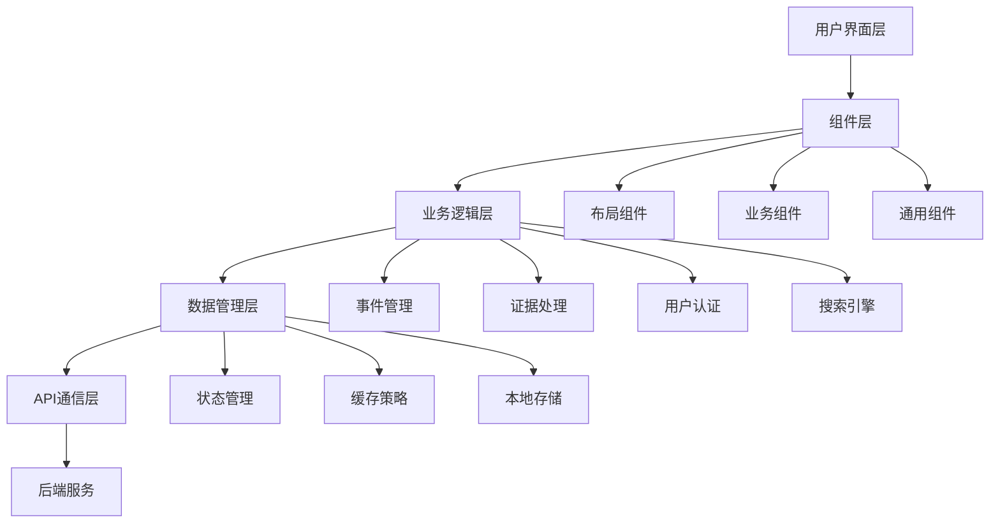
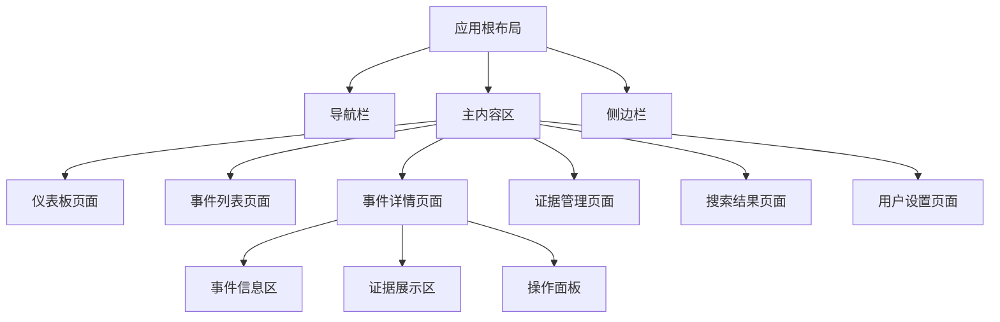

# 证据管理网站开发设计文档

## 1. 项目概述

### 项目背景
证据管理网站是一个专业的数字化证据收集和管理平台，旨在帮助用户系统性地收集、存储、管理和导出各类证据材料。该平台支持多种证据类型，包括图片、手写内容、视频、录音等，为法律事务、调研工作、案件管理等场景提供完整的数字化解决方案。

### 核心价值
- **多媒体证据支持**：统一管理图片、视频、音频、文档等多种格式
- **事件驱动管理**：以事件为中心组织证据，支持事件的持续更新
- **智能搜索**：提供全文搜索和模糊匹配功能
- **专业导出**：支持PDF和Excel格式的专业报告导出
- **安全可靠**：完整的用户权限管理和数据安全保障

### 目标用户
- 法律从业人员（律师、法务）
- 调研人员和记者
- 企业合规部门
- 个人用户（维权、纠纷处理）

## 2. 技术架构

### 技术栈
- **前端框架**：React 19.1.1 + TypeScript 5.8.3
- **构建工具**：Vite 7.1.2
- **样式方案**：Tailwind CSS + Headless UI
- **状态管理**：Zustand + React Query
- **路由管理**：React Router v6
- **UI组件库**：Radix UI + Lucide Icons
- **表单处理**：React Hook Form + Zod
- **文件处理**：React Dropzone + File API
- **PDF生成**：jsPDF + html2canvas
- **Excel导出**：SheetJS (xlsx)
- **设计工具**：Figma Design System

### 前端架构设计



## 3. 功能模块设计

### 3.1 用户认证模块

#### 功能特性
- 用户注册/登录/登出
- 密码重置和邮箱验证
- JWT令牌管理
- 权限控制

#### 组件结构
```
Authentication/
├── LoginForm.tsx
├── RegisterForm.tsx
├── ForgotPasswordForm.tsx
├── ProtectedRoute.tsx
└── AuthProvider.tsx
```

#### 状态管理
```typescript
interface AuthState {
  user: User | null
  token: string | null
  isAuthenticated: boolean
  loading: boolean
}
```

### 3.2 事件管理模块

#### 功能特性
- 创建、编辑、删除事件
- 事件分类和标签
- 事件时间线管理
- 事件状态跟踪

#### 数据模型
```typescript
interface Event {
  id: string
  title: string
  description: string
  category: EventCategory
  tags: string[]
  status: EventStatus
  createdAt: Date
  updatedAt: Date
  evidences: Evidence[]
  metadata: EventMetadata
}
```

#### 组件架构
```
Events/
├── EventList/
│   ├── EventCard.tsx
│   ├── EventFilters.tsx
│   └── EventListView.tsx
├── EventDetails/
│   ├── EventHeader.tsx
│   ├── EventTimeline.tsx
│   └── EventActions.tsx
└── EventForm/
    ├── CreateEventForm.tsx
    └── EditEventForm.tsx
```

### 3.3 证据管理模块

#### 支持的证据类型
- **图片证据**：JPEG, PNG, WebP (支持EXIF数据保留)
- **视频证据**：MP4, MOV, AVI (支持缩略图生成)
- **音频证据**：MP3, WAV, M4A (支持波形可视化)
- **文档证据**：PDF, DOC, DOCX, TXT
- **手写内容**：数字签名板集成
- **混合证据**：单个证据项可包含多种类型

#### 数据模型
```typescript
interface Evidence {
  id: string
  eventId: string
  type: EvidenceType
  title: string
  description: string
  files: EvidenceFile[]
  metadata: EvidenceMetadata
  tags: string[]
  createdAt: Date
  updatedAt: Date
}

interface EvidenceFile {
  id: string
  filename: string
  fileType: string
  fileSize: number
  url: string
  thumbnailUrl?: string
  checksum: string
}
```

#### 组件架构
```
Evidence/
├── EvidenceUpload/
│   ├── DropZone.tsx
│   ├── FilePreview.tsx
│   └── UploadProgress.tsx
├── EvidenceViewer/
│   ├── ImageViewer.tsx
│   ├── VideoPlayer.tsx
│   ├── AudioPlayer.tsx
│   └── DocumentViewer.tsx
├── EvidenceList/
│   ├── EvidenceGrid.tsx
│   ├── EvidenceCard.tsx
│   └── EvidenceFilters.tsx
└── EvidenceForm/
    ├── EvidenceMetadata.tsx
    └── TagManager.tsx
```

### 3.4 搜索功能模块

#### 搜索能力
- **全文搜索**：事件标题、描述、证据描述
- **标签搜索**：基于标签的精确匹配
- **时间范围搜索**：按创建时间、更新时间筛选
- **文件类型搜索**：按证据类型筛选
- **模糊搜索**：支持拼写错误容忍

#### 搜索组件
```
Search/
├── SearchBar.tsx
├── SearchFilters.tsx
├── SearchResults.tsx
├── AdvancedSearch.tsx
└── SearchHistory.tsx
```

#### 搜索状态管理
```typescript
interface SearchState {
  query: string
  filters: SearchFilters
  results: SearchResult[]
  loading: boolean
  history: SearchQuery[]
}
```

### 3.5 导出功能模块

#### PDF导出特性
- **事件报告**：完整的事件详情和所有证据
- **自定义模板**：专业的法律文档格式
- **水印支持**：添加时间戳和数字签名
- **目录生成**：自动生成文档目录

#### Excel导出特性
- **数据汇总**：事件列表和统计信息
- **证据清单**：详细的证据文件列表
- **时间线报表**：事件发展时间线
- **自定义字段**：用户可选择导出字段

#### 导出组件
```
Export/
├── ExportModal.tsx
├── PDFGenerator.tsx
├── ExcelGenerator.tsx
├── TemplateSelector.tsx
└── ExportProgress.tsx
```

## 4. 用户界面设计

### 4.1 设计系统

#### 颜色方案
```css
/* Primary Colors */
--primary-50: #f0f9ff
--primary-500: #3b82f6
--primary-600: #2563eb
--primary-700: #1d4ed8

/* Semantic Colors */
--success: #10b981
--warning: #f59e0b
--error: #ef4444
--info: #6366f1
```

#### 字体系统
```css
/* Typography Scale */
--font-family-sans: 'Inter', system-ui, sans-serif
--font-family-mono: 'JetBrains Mono', monospace

/* Font Sizes */
--text-xs: 0.75rem
--text-sm: 0.875rem
--text-base: 1rem
--text-lg: 1.125rem
--text-xl: 1.25rem
--text-2xl: 1.5rem
--text-3xl: 1.875rem
```

#### 组件规范
- **按钮**：主要操作（Primary）、次要操作（Secondary）、危险操作（Danger）
- **表单**：统一的输入框、选择器、文件上传组件
- **卡片**：证据卡片、事件卡片、信息卡片
- **导航**：顶部导航、侧边栏、面包屑导航

### 4.2 页面布局架构



### 4.3 响应式设计

#### 断点系统
```css
/* Breakpoints */
--breakpoint-sm: 640px   /* 手机横屏 */
--breakpoint-md: 768px   /* 平板竖屏 */
--breakpoint-lg: 1024px  /* 平板横屏/笔记本 */
--breakpoint-xl: 1280px  /* 桌面显示器 */
--breakpoint-2xl: 1536px /* 大屏显示器 */
```

#### 自适应策略
- **移动端**：单列布局，抽屉式导航，触摸优化
- **平板端**：双列布局，侧边导航，手势支持
- **桌面端**：多列布局，固定导航，键盘快捷键

## 5. 状态管理架构

### 5.1 Zustand Store 设计

```typescript
// 全局状态结构
interface AppState {
  // 用户认证状态
  auth: AuthState
  // 事件管理状态
  events: EventsState
  // 证据管理状态
  evidence: EvidenceState
  // 搜索状态
  search: SearchState
  // UI状态
  ui: UIState
}
```

### 5.2 React Query 数据缓存

```typescript
// 查询键命名规范
const queryKeys = {
  events: ['events'] as const,
  event: (id: string) => ['event', id] as const,
  evidence: (eventId: string) => ['evidence', eventId] as const,
  search: (query: string, filters: SearchFilters) => 
    ['search', query, filters] as const,
}
```

## 6. API 集成层

### 6.1 HTTP 客户端配置

```typescript
// API 客户端配置
const apiClient = axios.create({
  baseURL: process.env.VITE_API_BASE_URL,
  timeout: 30000,
  headers: {
    'Content-Type': 'application/json',
  },
})
```

### 6.2 API 接口规范

#### 事件相关接口
- `GET /api/events` - 获取事件列表
- `POST /api/events` - 创建新事件
- `GET /api/events/:id` - 获取事件详情
- `PUT /api/events/:id` - 更新事件
- `DELETE /api/events/:id` - 删除事件

#### 证据相关接口
- `POST /api/events/:id/evidence` - 上传证据
- `GET /api/evidence/:id` - 获取证据详情
- `PUT /api/evidence/:id` - 更新证据信息
- `DELETE /api/evidence/:id` - 删除证据

#### 文件处理接口
- `POST /api/files/upload` - 文件上传
- `GET /api/files/:id/download` - 文件下载
- `GET /api/files/:id/thumbnail` - 获取缩略图

## 7. 安全机制

### 7.1 认证与授权
- JWT令牌认证机制
- 刷新令牌自动续期
- 路由级别权限控制
- API请求权限验证

### 7.2 数据安全
- 文件上传类型限制
- 文件大小限制
- XSS攻击防护
- CSRF保护机制

### 7.3 隐私保护
- 敏感数据加密存储
- 用户数据访问控制
- 审计日志记录
- 数据删除权限管理

## 8. 性能优化策略

### 8.1 代码分割
```typescript
// 路由级别代码分割
const EventDetails = lazy(() => import('./pages/EventDetails'))
const EvidenceManager = lazy(() => import('./pages/EvidenceManager'))
```

### 8.2 图片优化
- WebP格式支持
- 响应式图片加载
- 图片懒加载
- 缩略图预加载

### 8.3 缓存策略
- React Query缓存配置
- 浏览器缓存优化
- CDN资源缓存
- 离线数据缓存

## 9. 测试策略

### 9.1 单元测试
```typescript
// 组件测试示例
describe('EventCard', () => {
  test('renders event information correctly', () => {
    const mockEvent = createMockEvent()
    render(<EventCard event={mockEvent} />)
    
    expect(screen.getByText(mockEvent.title)).toBeInTheDocument()
    expect(screen.getByText(mockEvent.description)).toBeInTheDocument()
  })
})
```

### 9.2 集成测试
- API接口测试
- 用户认证流程测试
- 文件上传流程测试
- 数据导出功能测试

### 9.3 端到端测试
- 用户注册登录流程
- 事件创建和编辑流程
- 证据上传和管理流程
- 搜索和导出功能

## 10. 部署与运维

### 10.1 构建配置
```typescript
// vite.config.ts 优化配置
export default defineConfig({
  plugins: [react()],
  build: {
    rollupOptions: {
      output: {
        manualChunks: {
          'react-vendor': ['react', 'react-dom'],
          'ui-vendor': ['@radix-ui/react-dialog', '@radix-ui/react-select'],
          'utils-vendor': ['date-fns', 'lodash-es']
        }
      }
    }
  },
  define: {
    'process.env': process.env
  }
})
```

### 10.2 环境配置
- 开发环境：热更新、详细错误信息
- 测试环境：模拟数据、性能监控
- 生产环境：代码压缩、错误追踪

### 10.3 监控指标
- 页面加载性能
- API响应时间
- 错误率统计
- 用户行为分析