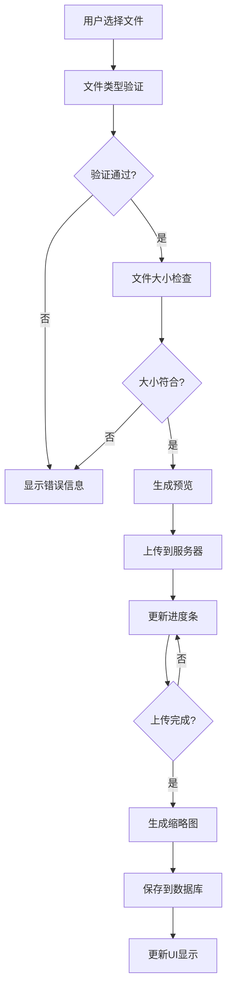
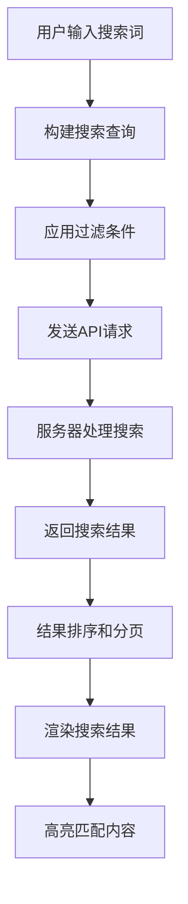
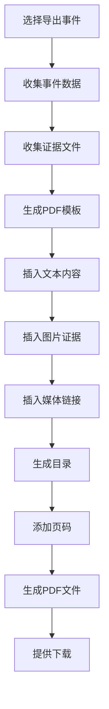

# 证据管理网站开发设计文档

## 1. 概述

### 1.1 项目简介
证据管理网站是一个专门用于收集、存储、管理和导出各类证据材料的Web应用程序。支持多媒体证据类型包括图片、手写内容、视频、录音等，提供完整的用户管理、事件管理、证据搜索和导出功能。

### 1.2 核心功能
- 用户注册登录系统
- 事件创建与管理
- 多媒体证据上传与存储
- 模糊搜索功能
- PDF/Excel导出功能
- 证据时间线管理
- 数据备份与恢复

## 2. 技术栈与依赖

### 2.1 前端技术栈
- **框架**: React 18+ with TypeScript
- **构建工具**: Vite
- **样式**: Tailwind CSS
- **UI组件库**: Headless UI / Radix UI
- **状态管理**: Zustand / Redux Toolkit
- **路由**: React Router Dom
- **表单处理**: React Hook Form + Zod
- **文件上传**: React Dropzone
- **富文本编辑**: Tiptap / Quill
- **图表**: Recharts
- **日期处理**: date-fns
- **HTTP客户端**: Axios
- **PDF生成**: jsPDF / React-PDF
- **Excel导出**: SheetJS

### 2.2 设计与UI
- **设计工具**: Figma
- **图标库**: Heroicons / Lucide React
- **字体**: Inter / Noto Sans SC

## 3. 组件架构

### 3.1 组件层级结构

```
App
├── Layout
│   ├── Header
│   │   ├── Navigation
│   │   ├── UserMenu
│   │   └── SearchBar
│   ├── Sidebar
│   └── Footer
├── Pages
│   ├── Auth
│   │   ├── Login
│   │   ├── Register
│   │   └── ForgotPassword
│   ├── Dashboard
│   │   ├── EventsList
│   │   ├── RecentActivity
│   │   └── Statistics
│   ├── Events
│   │   ├── EventDetail
│   │   ├── EventForm
│   │   └── EventTimeline
│   ├── Evidence
│   │   ├── EvidenceUploader
│   │   ├── EvidenceViewer
│   │   └── EvidenceEditor
│   └── Profile
│       ├── UserSettings
│       └── AccountSecurity
├── Components
│   ├── UI
│   │   ├── Button
│   │   ├── Input
│   │   ├── Modal
│   │   ├── Dropdown
│   │   ├── Card
│   │   ├── Table
│   │   └── Toast
│   ├── Features
│   │   ├── FileUpload
│   │   ├── MediaViewer
│   │   ├── SearchFilter
│   │   ├── ExportTools
│   │   └── TimelineView
│   └── Forms
│       ├── EventForm
│       ├── EvidenceForm
│       └── UserForm
```

### 3.2 核心组件定义

#### 3.2.1 EvidenceUploader Component
```typescript
interface EvidenceUploaderProps {
  eventId: string;
  onUploadComplete: (evidence: Evidence[]) => void;
  acceptedTypes: FileType[];
  maxFileSize: number;
  maxFiles: number;
}

interface FileType {
  type: 'image' | 'video' | 'audio' | 'document';
  extensions: string[];
  mimeTypes: string[];
}
```

#### 3.2.2 EventTimeline Component
```typescript
interface EventTimelineProps {
  eventId: string;
  evidences: Evidence[];
  isEditable: boolean;
  onEvidenceUpdate: (evidenceId: string, updates: Partial<Evidence>) => void;
}
```

#### 3.2.3 SearchFilter Component
```typescript
interface SearchFilterProps {
  onSearch: (query: SearchQuery) => void;
  filters: FilterOptions;
  placeholder: string;
}

interface SearchQuery {
  keyword: string;
  dateRange: { start: Date; end: Date };
  evidenceTypes: string[];
  tags: string[];
}
```

## 4. 路由与导航

### 4.1 路由结构
```typescript
const routes = [
  {
    path: '/',
    element: <Layout />,
    children: [
      { index: true, element: <Dashboard /> },
      { path: 'events', element: <EventsList /> },
      { path: 'events/:id', element: <EventDetail /> },
      { path: 'events/new', element: <EventForm /> },
      { path: 'search', element: <SearchResults /> },
      { path: 'profile', element: <UserProfile /> },
    ]
  },
  {
    path: '/auth',
    element: <AuthLayout />,
    children: [
      { path: 'login', element: <Login /> },
      { path: 'register', element: <Register /> },
      { path: 'forgot-password', element: <ForgotPassword /> }
    ]
  }
];
```

### 4.2 导航菜单结构
```typescript
const navigationItems = [
  { name: '仪表板', href: '/', icon: 'HomeIcon' },
  { name: '事件管理', href: '/events', icon: 'FolderIcon' },
  { name: '搜索', href: '/search', icon: 'MagnifyingGlassIcon' },
  { name: '统计分析', href: '/analytics', icon: 'ChartBarIcon' },
  { name: '设置', href: '/profile', icon: 'CogIcon' }
];
```

## 5. 样式策略

### 5.1 Tailwind CSS 配置
```javascript
// tailwind.config.js
module.exports = {
  content: ['./src/**/*.{js,ts,jsx,tsx}'],
  theme: {
    extend: {
      colors: {
        primary: {
          50: '#eff6ff',
          500: '#3b82f6',
          600: '#2563eb',
          700: '#1d4ed8'
        },
        gray: {
          50: '#f9fafb',
          100: '#f3f4f6',
          900: '#111827'
        }
      },
      fontFamily: {
        sans: ['Inter', 'Noto Sans SC', 'system-ui', 'sans-serif']
      }
    }
  }
}
```

### 5.2 设计系统

#### 颜色规范
| 用途 | 颜色值 | Tailwind类 |
|------|--------|-------------|
| 主色调 | #3b82f6 | `bg-primary-500` |
| 成功状态 | #10b981 | `text-green-500` |
| 警告状态 | #f59e0b | `text-yellow-500` |
| 错误状态 | #ef4444 | `text-red-500` |
| 文本主色 | #111827 | `text-gray-900` |
| 文本次色 | #6b7280 | `text-gray-500` |

#### 间距系统
- 基础间距单位：4px (Tailwind的spacing-1)
- 组件内边距：16px (`p-4`)
- 组件外边距：24px (`m-6`)
- 页面边距：32px (`p-8`)

## 6. 状态管理

### 6.1 Zustand Store 结构
```typescript
interface AppState {
  // 用户状态
  user: User | null;
  isAuthenticated: boolean;
  
  // 事件状态
  events: Event[];
  currentEvent: Event | null;
  
  // 证据状态
  evidences: Evidence[];
  uploadingFiles: UploadingFile[];
  
  // UI状态
  isLoading: boolean;
  notifications: Notification[];
  modals: ModalState;
}

// Actions
interface AppActions {
  // 用户相关
  login: (credentials: LoginCredentials) => Promise<void>;
  logout: () => void;
  updateProfile: (updates: Partial<User>) => Promise<void>;
  
  // 事件相关
  createEvent: (eventData: CreateEventData) => Promise<Event>;
  updateEvent: (eventId: string, updates: Partial<Event>) => Promise<void>;
  deleteEvent: (eventId: string) => Promise<void>;
  
  // 证据相关
  uploadEvidence: (files: File[], eventId: string) => Promise<void>;
  updateEvidence: (evidenceId: string, updates: Partial<Evidence>) => Promise<void>;
  deleteEvidence: (evidenceId: string) => Promise<void>;
}
```

### 6.2 数据模型

#### User Model
```typescript
interface User {
  id: string;
  email: string;
  username: string;
  fullName: string;
  avatar?: string;
  role: 'admin' | 'user';
  createdAt: Date;
  updatedAt: Date;
  preferences: UserPreferences;
}

interface UserPreferences {
  theme: 'light' | 'dark';
  language: 'zh-CN' | 'en-US';
  notifications: NotificationSettings;
}
```

#### Event Model
```typescript
interface Event {
  id: string;
  title: string;
  description: string;
  category: string;
  tags: string[];
  status: 'active' | 'archived' | 'deleted';
  createdBy: string;
  createdAt: Date;
  updatedAt: Date;
  evidenceCount: number;
  metadata: EventMetadata;
}

interface EventMetadata {
  location?: string;
  participants?: string[];
  relatedCases?: string[];
  priority: 'low' | 'medium' | 'high';
}
```

#### Evidence Model
```typescript
interface Evidence {
  id: string;
  eventId: string;
  type: 'image' | 'video' | 'audio' | 'document' | 'handwritten';
  fileName: string;
  originalName: string;
  fileSize: number;
  mimeType: string;
  url: string;
  thumbnailUrl?: string;
  title: string;
  description: string;
  tags: string[];
  metadata: EvidenceMetadata;
  createdAt: Date;
  updatedAt: Date;
}

interface EvidenceMetadata {
  duration?: number; // for video/audio
  dimensions?: { width: number; height: number }; // for images
  location?: GeolocationData;
  deviceInfo?: DeviceInfo;
  checksum: string;
}
```

## 7. API集成层

### 7.1 HTTP客户端配置
```typescript
// api/client.ts
import axios from 'axios';

const apiClient = axios.create({
  baseURL: process.env.VITE_API_BASE_URL,
  timeout: 30000,
  headers: {
    'Content-Type': 'application/json'
  }
});

// 请求拦截器
apiClient.interceptors.request.use((config) => {
  const token = localStorage.getItem('access_token');
  if (token) {
    config.headers.Authorization = `Bearer ${token}`;
  }
  return config;
});

// 响应拦截器
apiClient.interceptors.response.use(
  (response) => response,
  (error) => {
    if (error.response?.status === 401) {
      // 处理token过期
      localStorage.removeItem('access_token');
      window.location.href = '/auth/login';
    }
    return Promise.reject(error);
  }
);
```

### 7.2 API服务模块
```typescript
// api/services/
export const authService = {
  login: (credentials: LoginCredentials) => 
    apiClient.post('/auth/login', credentials),
  register: (userData: RegisterData) => 
    apiClient.post('/auth/register', userData),
  refreshToken: (refreshToken: string) => 
    apiClient.post('/auth/refresh', { refreshToken })
};

export const eventService = {
  getEvents: (params: GetEventsParams) => 
    apiClient.get('/events', { params }),
  createEvent: (eventData: CreateEventData) => 
    apiClient.post('/events', eventData),
  updateEvent: (id: string, updates: Partial<Event>) => 
    apiClient.put(`/events/${id}`, updates),
  deleteEvent: (id: string) => 
    apiClient.delete(`/events/${id}`)
};

export const evidenceService = {
  uploadFiles: (formData: FormData, eventId: string) => 
    apiClient.post(`/events/${eventId}/evidence`, formData, {
      headers: { 'Content-Type': 'multipart/form-data' }
    }),
  updateEvidence: (id: string, updates: Partial<Evidence>) => 
    apiClient.put(`/evidence/${id}`, updates),
  deleteEvidence: (id: string) => 
    apiClient.delete(`/evidence/${id}`)
};
```

## 8. 核心功能设计

### 8.1 文件上传系统

#### 8.1.1 多文件上传流程图


#### 8.1.2 上传配置
```typescript
const uploadConfig = {
  maxFileSize: 100 * 1024 * 1024, // 100MB
  allowedTypes: {
    image: ['jpg', 'jpeg', 'png', 'gif', 'webp'],
    video: ['mp4', 'avi', 'mov', 'wmv'],
    audio: ['mp3', 'wav', 'aac', 'm4a'],
    document: ['pdf', 'doc', 'docx', 'txt']
  },
  concurrent: 3, // 同时上传文件数
  chunkSize: 2 * 1024 * 1024 // 2MB chunks for large files
};
```

### 8.2 搜索功能设计

#### 8.2.1 搜索流程图


#### 8.2.2 搜索算法
```typescript
interface SearchOptions {
  fuzzySearch: boolean;
  caseSensitive: boolean;
  searchFields: ('title' | 'description' | 'tags' | 'fileName')[];
  dateRange?: { start: Date; end: Date };
  fileTypes?: string[];
  sortBy: 'relevance' | 'date' | 'size';
  sortOrder: 'asc' | 'desc';
}
```

### 8.3 导出功能设计

#### 8.3.1 PDF导出流程


#### 8.3.2 Excel导出结构
| 字段 | 类型 | 描述 |
|------|------|------|
| 事件ID | String | 唯一标识符 |
| 事件标题 | String | 事件名称 |
| 创建时间 | Date | 事件创建日期 |
| 证据数量 | Number | 关联证据总数 |
| 证据列表 | String | 证据文件名列表 |
| 标签 | String | 逗号分隔的标签 |
| 状态 | String | 事件当前状态 |

## 9. 项目初始化与部署

### 9.1 项目初始化步骤

#### 9.1.1 创建Vite + React + TypeScript项目
```bash
# 创建项目
npm create vite@latest evidence-management --template react-ts
cd evidence-management

# 安装依赖
npm install

# 安装额外依赖
npm install @headlessui/react @heroicons/react
npm install zustand react-router-dom react-hook-form @hookform/resolvers zod
npm install axios date-fns
npm install react-dropzone
npm install jspdf xlsx
npm install @types/node

# 开发依赖
npm install -D @types/react @types/react-dom
npm install -D tailwindcss postcss autoprefixer
npm install -D eslint @typescript-eslint/eslint-plugin
npm install -D prettier eslint-config-prettier
npm install -D @testing-library/react @testing-library/jest-dom
npm install -D vitest jsdom
```

#### 9.1.2 配置Tailwind CSS
```bash
# 初始化Tailwind
npx tailwindcss init -p
```

#### 9.1.3 Git仓库初始化与配置
```bash
# 初始化Git仓库
git init

# 添加远程仓库
git remote add origin git@github.com:lantah-1/test.git

# 创建.gitignore文件
echo "node_modules/" > .gitignore
echo "dist/" >> .gitignore
echo ".env.local" >> .gitignore
echo ".DS_Store" >> .gitignore

# 添加所有文件
git add .

# 提交初始代码
git commit -m "feat: 初始化证据管理网站项目

- 配置Vite + React + TypeScript
- 集成Tailwind CSS
- 添加核心依赖包
- 设置项目基础结构"

# 推送到远程仓库
git branch -M main
git push -u origin main
```

### 9.2 项目目录结构
```
evidence-management/
├── public/
│   ├── favicon.ico
│   └── index.html
├── src/
│   ├── components/
│   │   ├── ui/
│   │   ├── features/
│   │   └── forms/
│   ├── pages/
│   │   ├── auth/
│   │   ├── dashboard/
│   │   ├── events/
│   │   └── evidence/
│   ├── hooks/
│   ├── store/
│   ├── services/
│   ├── utils/
│   ├── types/
│   ├── assets/
│   ├── styles/
│   ├── App.tsx
│   └── main.tsx
├── .env.example
├── .gitignore
├── package.json
├── tsconfig.json
├── tailwind.config.js
├── vite.config.ts
└── README.md
```

### 9.3 环境配置

#### 9.3.1 环境变量设置
```bash
# .env.example
VITE_API_BASE_URL=http://localhost:3001/api
VITE_APP_NAME=证据管理系统
VITE_FILE_UPLOAD_MAX_SIZE=104857600
VITE_SUPPORTED_FILE_TYPES=jpg,jpeg,png,gif,mp4,mp3,pdf,doc,docx
```

#### 9.3.2 TypeScript配置
```json
// tsconfig.json
{
  "compilerOptions": {
    "target": "ES2020",
    "useDefineForClassFields": true,
    "lib": ["ES2020", "DOM", "DOM.Iterable"],
    "module": "ESNext",
    "skipLibCheck": true,
    "moduleResolution": "bundler",
    "allowImportingTsExtensions": true,
    "resolveJsonModule": true,
    "isolatedModules": true,
    "noEmit": true,
    "jsx": "react-jsx",
    "strict": true,
    "noUnusedLocals": true,
    "noUnusedParameters": true,
    "noFallthroughCasesInSwitch": true,
    "baseUrl": ".",
    "paths": {
      "@/*": ["src/*"]
    }
  },
  "include": ["src"],
  "references": [{ "path": "./tsconfig.node.json" }]
}
```

### 9.4 开发工作流

#### 9.4.1 Git提交规范
```bash
# 功能开发
git commit -m "feat: 添加用户登录功能"

# 修复Bug
git commit -m "fix: 修复文件上传进度显示问题"

# 样式调整
git commit -m "style: 优化事件列表页面布局"

# 重构代码
git commit -m "refactor: 重构证据管理组件结构"

# 文档更新
git commit -m "docs: 更新API接口文档"

# 测试相关
git commit -m "test: 添加文件上传组件单元测试"
```

#### 9.4.2 分支管理策略
```bash
# 功能分支
git checkout -b feature/user-authentication
git checkout -b feature/evidence-upload
git checkout -b feature/export-functionality

# 修复分支
git checkout -b hotfix/login-validation

# 发布分支
git checkout -b release/v1.0.0
```

## 10. 测试策略

### 9.1 单元测试
```typescript
// 测试组件示例
describe('EvidenceUploader', () => {
  test('应该正确验证文件类型', () => {
    const validFile = new File(['test'], 'test.jpg', { type: 'image/jpeg' });
    const invalidFile = new File(['test'], 'test.exe', { type: 'application/exe' });
    
    expect(validateFileType(validFile)).toBe(true);
    expect(validateFileType(invalidFile)).toBe(false);
  });
  
  test('应该正确处理文件上传进度', async () => {
    const mockOnProgress = jest.fn();
    await uploadFile(mockFile, mockOnProgress);
    
    expect(mockOnProgress).toHaveBeenCalledWith(
      expect.objectContaining({
        percentage: expect.any(Number)
      })
    );
  });
});
```

### 9.2 集成测试
```typescript
// API集成测试
describe('Evidence API Integration', () => {
  test('应该成功上传和检索证据', async () => {
    const mockEvent = await createTestEvent();
    const mockFile = createMockFile();
    
    const uploadResult = await evidenceService.uploadFiles(mockFile, mockEvent.id);
    expect(uploadResult.status).toBe(200);
    
    const evidences = await evidenceService.getEvidencesByEvent(mockEvent.id);
    expect(evidences.data).toHaveLength(1);
  });
});
```

### 9.3 E2E测试框架
使用Playwright或Cypress进行端到端测试：
```typescript
// e2e tests
test('用户应该能够完整的证据管理流程', async ({ page }) => {
  // 登录
  await page.goto('/auth/login');
  await page.fill('[data-testid="email"]', 'user@example.com');
  await page.fill('[data-testid="password"]', 'password');
  await page.click('[data-testid="login-button"]');
  
  // 创建事件
  await page.click('[data-testid="create-event"]');
  await page.fill('[data-testid="event-title"]', '测试事件');
  await page.click('[data-testid="save-event"]');
  
  // 上传证据
  await page.setInputFiles('[data-testid="file-upload"]', 'test-image.jpg');
  await page.waitForSelector('[data-testid="upload-success"]');
  
  // 验证证据显示
  await expect(page.locator('[data-testid="evidence-item"]')).toBeVisible();
});
```